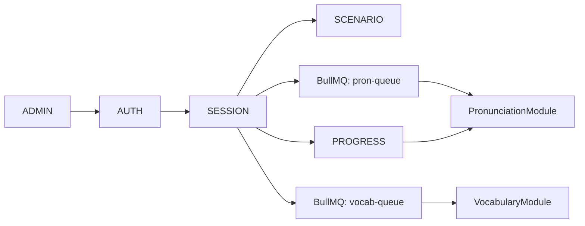
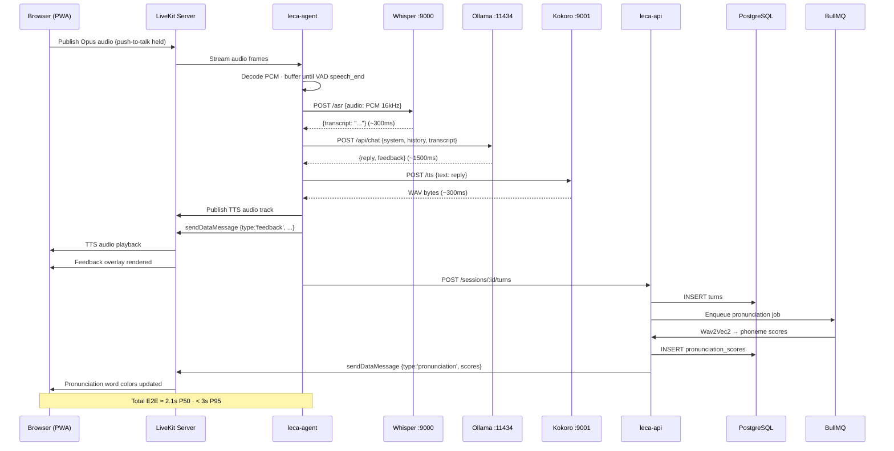
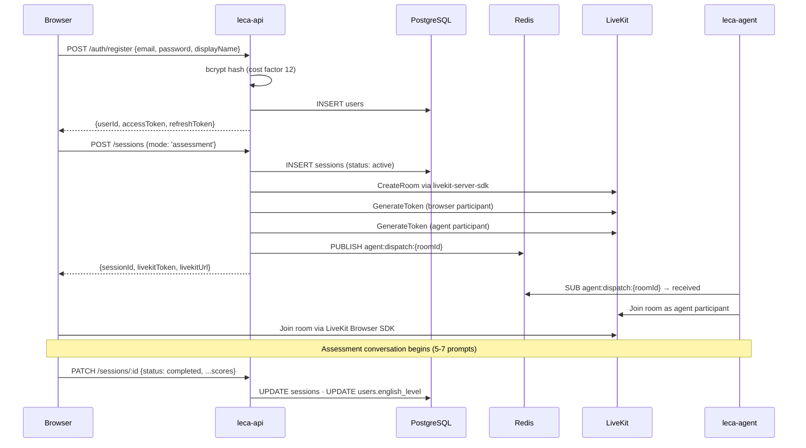
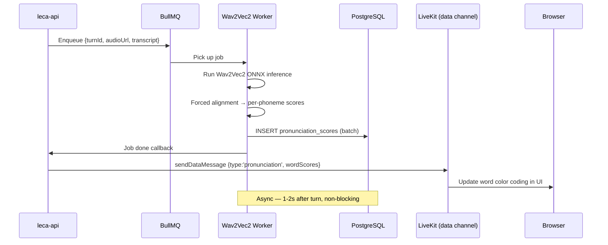

# LECA — Architecture Design Document

**Product**: LECA (Language & English Communication AI)  
**Document Type**: System Design — High-Level & Low-Level Architecture  
**Version**: 1.0  
**Status**: Draft  
**Date**: 2026-05-28  
**Based on**: BRD v0.6, SRS v1.0

---

## Table of Contents

1. [Architectural Decisions](#1-architectural-decisions)
2. [High-Level Architecture (HLD)](#2-high-level-architecture-hld)
3. [Database Schema](#3-database-schema-phase-3--system-design)
4. [Low-Level Design (LLD)](#4-low-level-design-lld)
5. [API Contracts](#5-api-contracts)
6. [Tech Stack Summary](#6-tech-stack-summary)

---

## 1. Architectural Decisions

### ADR-01 — Backend: NestJS (Node.js / TypeScript)

**Context**: Small founding team, OSS project, TypeScript already used on frontend (Next.js).

**Decision**: NestJS (Node.js) as the API backend. TypeScript end-to-end.

**Rationale**:
- TypeScript on both frontend and backend → one language for all contributors, lowest OSS onboarding barrier
- NestJS is opinionated and modular → enforces clear boundaries (Auth, Session, Scenario, Progress modules) without discipline overhead
- All AI services (Whisper, Ollama, Gemini) are reachable via HTTP REST — no Python runtime needed in the API server
- Wav2Vec2 runs via `onnxruntime-node` directly in NestJS process (Phase 0) or client-side WASM (Phase 1+)
- LiveKit token generation uses `livekit-server-sdk` npm package (full Node.js support)
- OpenAPI spec auto-generated via `@nestjs/swagger`

**Trade-offs accepted**: Wav2Vec2 inference in Node.js is slightly less ergonomic than Python HuggingFace, but `onnxruntime-node` is production-ready and well-maintained.

---

### ADR-02 — Frontend: Next.js 14+ PWA

**Context**: Mobile-first (Android 8+), PWA required, no native app for MVP, must run Kokoro-js and Wav2Vec2 WASM in-browser.

**Decision**: Next.js 14 (App Router) with `next-pwa` for PWA output.

**Rationale**:
- React/JSX is the most widely known frontend stack → lowest barrier for OSS contributors (Segment 4)
- App Router enables SSR + streaming for initial page load performance
- Huge ecosystem: shadcn/ui, Recharts, React Hook Form — less custom code
- Web Workers fully supported for WASM AI workloads (Kokoro-js, Wav2Vec2)
- Bundle size managed via code splitting, lazy imports, and dynamic components

---

### ADR-03 — AI Pipeline: Fixed Stack (Ollama cho LLM)

**Context**: LLM stack được giữ cố định — Ollama + LLaMA 3 8B Q4 chạy server-side cho tất cả phases.

**Decision**: Không cần phase-switching cho LLM. Một stack duy nhất: Whisper (STT) + Ollama (LLM) + Kokoro (TTS) + Wav2Vec2 (Pronunciation background job). Tất cả là Docker HTTP services, NestJS gọi qua REST.

---

### ADR-04 — Real-time Audio: LiveKit (self-hosted)

**Context**: LECA needs real-time voice streaming between browser and AI pipeline. Options: raw WebSocket or LiveKit.

**Decision**: LiveKit self-hosted (open-source, Apache 2.0) as the audio transport and AI agent orchestration layer.

**Rationale**:
- WebRTC (LiveKit) vs raw WebSocket: Opus codec (3–4× smaller than raw PCM), built-in echo cancellation, jitter buffer, packet loss recovery — critical for Android users on mobile data in Vietnam/Indonesia
- `livekit-server-sdk` npm package handles token generation and room management natively in Node.js
- AI pipeline (STT → LLM → TTS) wired manually in NestJS via HTTP calls to Whisper Docker + Ollama + Kokoro — full control, no Python dependency
- Built-in VAD (Voice Activity Detection) handles push-to-talk logic server-side
- Self-hosted LiveKit server runs in Docker alongside other services — no LiveKit Cloud dependency, no usage fees
- LiveKit Cloud free tier (1,000 min/month) is insufficient for Phase 1 (500 DAU × 10 min = 5,000 min/day), so self-hosting is required anyway

**Trade-offs accepted**: +1 service trong Docker Compose; Ollama cần đủ RAM cho model (8GB+ cho LLaMA 3 8B Q4).

---

### ADR-05 — Database: PostgreSQL + Redis

**Decision**: PostgreSQL for all persistent data; Redis for sessions, rate-limiting, scenario cache.

**Rationale**: Relational model fits structured learner/session/progress data. PostgreSQL full-text search covers scenario search (< 1,000 scenarios in Phase 0–1, no Elasticsearch needed). Redis handles rate-limiting (NFR-SEC-05) and caches frequently-read scenarios (NFR-REL-04).

---

## 2. High-Level Architecture (HLD)

> **Two separate services:**
> - `leca-api` (NestJS) — REST API, JWT + token generation, DB, BullMQ. Does NOT touch audio.
> - `leca-agent` (Node.js / TypeScript) — joins LiveKit room as a participant, subscribes to browser audio track, runs STT→LLM→TTS pipeline, publishes TTS audio back.

```
┌─────────────────────────────────────────────────────────────────────┐
│                    CLIENT LAYER (PWA — Next.js 14)                   │
│                                                                       │
│  ┌───────────────────┐  ┌──────────────────┐  ┌───────────────────┐  │
│  │  Conversation UI  │  │  Scenario Browser │  │  Progress         │  │
│  │  (push-to-talk)   │  │  + Vocab Panel    │  │  Dashboard        │  │
│  └─────────┬─────────┘  └────────┬──────────┘  └────────┬──────────┘  │
│            │ LiveKit              │ REST API             │ REST API    │
│            │ Browser SDK         │                      │             │
└────────────┼─────────────────────┼──────────────────────┼─────────────┘
             │ WebRTC (Opus)        │                      │
             │                     ▼                      ▼
             │         ┌───────────────────────────────────────────────┐
             │         │         leca-api (NestJS — TypeScript)         │
             │         │  auth │ assessment │ vocabulary │ scenario     │
             │         │  progress │ admin │ BullMQ jobs                │
             │         └───────────────────────────────────────────────┘
             │                     │ livekit-server-sdk (room + token)
             ▼                     │
┌─────────────────────────────────────────────────────────────────────┐
│                   LiveKit Server (self-hosted)                        │
│         WebRTC media server — Opus, VAD, echo cancel, jitter buffer  │
│                                                                       │
│   ┌──────────────────────┐      ┌────────────────────────────────┐   │
│   │  Browser Participant  │◄────►│  Agent Participant              │   │
│   │  (learner audio out) │      │  (leca-agent service)           │   │
│   │  (TTS audio in)      │      │  join room, subscribe audio,    │   │
│   └──────────────────────┘      │  publish TTS track              │   │
│                                  └─────────────┬──────────────────┘   │
└──────────────────────────────────────────────┼─────────────────────┘
                                                │ HTTP REST
┌───────────────────────────────────────────────▼─────────────────────┐
│                     AI Services (Docker)                               │
│  ┌───────────────────┐  ┌──────────────────┐  ┌──────────────────┐   │
│  │  Whisper Docker   │  │  Ollama           │  │  Kokoro Docker   │   │
│  │  STT (port 9000)  │  │  LLaMA 3 8B Q4   │  │  TTS (port 9001) │   │
│  └───────────────────┘  └──────────────────┘  └──────────────────┘   │
└──────────────────────────────────────────────────────────────────────┘

┌──────────────────────────────────────────────────────────────────────┐
│                           DATA LAYER                                   │
│  ┌──────────────────────────────┐  ┌─────────────────────────────────┐ │
│  │  PostgreSQL                   │  │  Redis                           │ │
│  │  users, sessions, turns       │  │  JWT sessions, rate limit,      │ │
│  │  pronunciation_scores         │  │  scenario cache, BullMQ         │ │
│  │  scenarios, user_vocabulary   │  │                                 │ │
│  │  level_assessments, classes   │  │                                 │ │
│  └──────────────────────────────┘  └─────────────────────────────────┘ │
└──────────────────────────────────────────────────────────────────────┘
```

### Data Flow — Conversation Turn

```
1. Browser → POST /api/sessions (leca-api)
   NestJS: create DB session + LiveKit room
   NestJS: generate livekitToken for browser, dispatch leca-agent into room
   Returns: { sessionId, livekitToken, livekitUrl }

2. Browser joins room via LiveKit Browser SDK (livekitToken)
   leca-agent joins same room (agent token, internal)
   → Both are participants in the same LiveKit room

3. Learner presses push-to-talk
   → Browser publishes Opus audio track

4. [leca-agent] receives audio track (WebRTC subscription)
   → buffers audio until VAD detects speech end
   → POST Whisper Docker HTTP → transcript            (~0.3s)
   → POST Ollama HTTP → response + feedback JSON      (~1.5s)
   → POST Kokoro Docker HTTP → TTS audio              (~0.3s)
   → publishes TTS audio track to room
   → sends LiveKit data message: { type: 'feedback', ... }

5. Browser
   → plays TTS audio track (AI response)
   → receives data message → renders feedback overlay

6. [leca-agent] → POST /api/sessions/{id}/turns (leca-api)
   NestJS: persists turn; enqueues BullMQ jobs:
   → pronunciation job: Wav2Vec2 → phoneme scores → DB
                        → LiveKit data msg → browser UI (1–2s later)
   → vocabulary job:    gap detection → upsert user_vocabulary

Total E2E (audio in → audio out): ~2.1s P50, < 3s P95 ✓
```

---

## 3. Database Schema (Phase 3 — System Design)

> **Database**: PostgreSQL 16 (primary) + Redis 7 (cache/sessions).  
> All UUIDs use `gen_random_uuid()`. All timestamps stored in UTC.  
> Schema covers Phases 0–3; Phase 3 additions are marked `-- Phase 3`.

---

### 3.1 Entity Relationship Overview

```
organizations ──< users ──< sessions ──< turns ──< pronunciation_scores
     │               │          │
     └──< classes    │          └── scenario (fk)
           │         │
           └──< class_enrollments >──┘ (users)
                         
scenario_packs ──< scenarios ──< scenario_phrases
                       │              │
                       └──< scenario_reviews   └──< user_vocabulary >── users
                       └──< scenario_ratings

users ──< level_assessments
users ──< devices                     (Phase 3 — native apps)
users ──< daily_user_stats            (Phase 3 — advanced analytics)
```

---

### 3.2 SQL Schema

```sql
-- ============================================================
-- ORGANIZATIONS  (Phase 3 — multi-tenant SaaS tier)
-- ============================================================
CREATE TABLE organizations (
  id            UUID PRIMARY KEY DEFAULT gen_random_uuid(),
  name          VARCHAR(255)  NOT NULL,
  slug          VARCHAR(100)  NOT NULL UNIQUE,
  plan          VARCHAR(20)   NOT NULL DEFAULT 'self_hosted'
                  CHECK (plan IN ('self_hosted', 'cloud_free', 'cloud_paid')),
  max_users     INT,
  lti_key       VARCHAR(255),
  lti_secret    VARCHAR(255),
  is_active     BOOLEAN       NOT NULL DEFAULT TRUE,
  created_at    TIMESTAMP     NOT NULL DEFAULT CURRENT_TIMESTAMP,
  updated_at    TIMESTAMP     NOT NULL DEFAULT CURRENT_TIMESTAMP
);

-- ============================================================
-- USERS
-- ============================================================
CREATE TABLE users (
  id              UUID PRIMARY KEY DEFAULT gen_random_uuid(),
  organization_id UUID          REFERENCES organizations(id) ON DELETE SET NULL,
  email           VARCHAR(255)  NOT NULL UNIQUE,
  password_hash   VARCHAR(255),
  display_name    VARCHAR(100)  NOT NULL,
  native_language CHAR(5),                          -- BCP-47: 'vi', 'id', 'pt-BR'
  english_level   VARCHAR(3)    CHECK (english_level IN ('A1','A2','B1','B2','C1','C2')),
  role            VARCHAR(20)   NOT NULL DEFAULT 'learner'
                    CHECK (role IN ('learner','teacher','admin','maintainer')),
  timezone        VARCHAR(50),
  is_active       BOOLEAN       NOT NULL DEFAULT TRUE,
  last_active_at  TIMESTAMP,
  created_at      TIMESTAMP     NOT NULL DEFAULT CURRENT_TIMESTAMP,
  updated_at      TIMESTAMP     NOT NULL DEFAULT CURRENT_TIMESTAMP
);

CREATE INDEX idx_users_org      ON users(organization_id);
CREATE INDEX idx_users_role     ON users(role);
CREATE INDEX idx_users_active   ON users(is_active, last_active_at);

-- ============================================================
-- DEVICES  (Phase 3 — native iOS/Android push notifications)
-- ============================================================
CREATE TABLE devices (
  id           UUID PRIMARY KEY DEFAULT gen_random_uuid(),
  user_id      UUID         NOT NULL REFERENCES users(id) ON DELETE CASCADE,
  platform     VARCHAR(10)  NOT NULL CHECK (platform IN ('ios','android','web')),
  push_token   TEXT         UNIQUE,
  app_version  VARCHAR(20),
  last_seen_at TIMESTAMP,
  created_at   TIMESTAMP    NOT NULL DEFAULT CURRENT_TIMESTAMP
);

CREATE INDEX idx_devices_user ON devices(user_id);

-- ============================================================
-- CLASSES  (institutional)
-- ============================================================
CREATE TABLE classes (
  id              UUID PRIMARY KEY DEFAULT gen_random_uuid(),
  organization_id UUID          REFERENCES organizations(id) ON DELETE SET NULL,
  teacher_id      UUID          NOT NULL REFERENCES users(id),
  name            VARCHAR(255)  NOT NULL,
  join_code       CHAR(8)       NOT NULL UNIQUE,
  target_level    VARCHAR(3)    CHECK (target_level IN ('A1','A2','B1','B2','C1','C2')),
  is_active       BOOLEAN       NOT NULL DEFAULT TRUE,
  created_at      TIMESTAMP     NOT NULL DEFAULT CURRENT_TIMESTAMP,
  updated_at      TIMESTAMP     NOT NULL DEFAULT CURRENT_TIMESTAMP
);

CREATE INDEX idx_classes_teacher ON classes(teacher_id);
CREATE INDEX idx_classes_org     ON classes(organization_id);

-- ============================================================
-- CLASS ENROLLMENTS  (many-to-many: users ↔ classes)
-- ============================================================
CREATE TABLE class_enrollments (
  class_id    UUID      NOT NULL REFERENCES classes(id) ON DELETE CASCADE,
  user_id     UUID      NOT NULL REFERENCES users(id)   ON DELETE CASCADE,
  enrolled_at TIMESTAMP NOT NULL DEFAULT CURRENT_TIMESTAMP,
  PRIMARY KEY (class_id, user_id)
);

CREATE INDEX idx_enrollments_user  ON class_enrollments(user_id);

-- ============================================================
-- SCENARIO PACKS  (Phase 3 — domain-specific packs)
-- ============================================================
CREATE TABLE scenario_packs (
  id             UUID PRIMARY KEY DEFAULT gen_random_uuid(),
  name           VARCHAR(255) NOT NULL,
  slug           VARCHAR(100) NOT NULL UNIQUE,
  domain         VARCHAR(50)  NOT NULL
                   CHECK (domain IN ('general','business','medical','academic','travel')),
  description    TEXT,
  difficulty_min VARCHAR(3)   CHECK (difficulty_min IN ('A1','A2','B1','B2','C1','C2')),
  difficulty_max VARCHAR(3)   CHECK (difficulty_max IN ('A1','A2','B1','B2','C1','C2')),
  is_featured    BOOLEAN      NOT NULL DEFAULT FALSE,
  created_at     TIMESTAMP    NOT NULL DEFAULT CURRENT_TIMESTAMP,
  updated_at     TIMESTAMP    NOT NULL DEFAULT CURRENT_TIMESTAMP
);

-- ============================================================
-- SCENARIOS
-- ============================================================
CREATE TABLE scenarios (
  id               UUID PRIMARY KEY DEFAULT gen_random_uuid(),
  pack_id          UUID          REFERENCES scenario_packs(id) ON DELETE SET NULL,
  author_id        UUID          REFERENCES users(id)          ON DELETE SET NULL,
  fork_of          UUID          REFERENCES scenarios(id)      ON DELETE SET NULL,
  title            VARCHAR(255)  NOT NULL,
  description      TEXT,
  ai_role          TEXT          NOT NULL,    -- role the AI plays in this scenario
  context          TEXT          NOT NULL,    -- scene-setting prompt sent to LLM
  difficulty       VARCHAR(3)    NOT NULL CHECK (difficulty IN ('A1','A2','B1','B2','C1','C2')),
  situation_type   VARCHAR(10)   NOT NULL CHECK (situation_type IN ('everyday','work')),
  tags             TEXT[],                    -- PostgreSQL array for flexible tagging
  status           VARCHAR(20)   NOT NULL DEFAULT 'draft'
                     CHECK (status IN ('draft','in_review','featured','archived')),
  rating_avg       DECIMAL(3,2)  CHECK (rating_avg BETWEEN 1.00 AND 5.00),
  rating_count     INT           NOT NULL DEFAULT 0 CHECK (rating_count >= 0),
  use_count        INT           NOT NULL DEFAULT 0 CHECK (use_count >= 0),
  created_at       TIMESTAMP     NOT NULL DEFAULT CURRENT_TIMESTAMP,
  updated_at       TIMESTAMP     NOT NULL DEFAULT CURRENT_TIMESTAMP
);

CREATE INDEX idx_scenarios_pack        ON scenarios(pack_id);
CREATE INDEX idx_scenarios_author      ON scenarios(author_id);
CREATE INDEX idx_scenarios_status_diff ON scenarios(status, difficulty);
CREATE INDEX idx_scenarios_situation   ON scenarios(situation_type);
CREATE INDEX idx_scenarios_featured    ON scenarios(status, rating_avg DESC) WHERE status = 'featured';

-- ============================================================
-- SCENARIO PHRASES  (vocabulary / key phrases per scenario)
-- ============================================================
CREATE TABLE scenario_phrases (
  id              UUID PRIMARY KEY DEFAULT gen_random_uuid(),
  scenario_id     UUID         NOT NULL REFERENCES scenarios(id) ON DELETE CASCADE,
  phrase          TEXT         NOT NULL,
  example_sentence TEXT        NOT NULL,
  audio_url       TEXT,                       -- pre-generated TTS URL
  difficulty      VARCHAR(3)   CHECK (difficulty IN ('A1','A2','B1','B2','C1','C2')),
  display_order   SMALLINT     NOT NULL DEFAULT 0,
  created_at      TIMESTAMP    NOT NULL DEFAULT CURRENT_TIMESTAMP
);

CREATE INDEX idx_phrases_scenario ON scenario_phrases(scenario_id, display_order);

-- ============================================================
-- SCENARIO REVIEWS  (Phase 3 — community governance)
-- ============================================================
CREATE TABLE scenario_reviews (
  id           UUID PRIMARY KEY DEFAULT gen_random_uuid(),
  scenario_id  UUID        NOT NULL REFERENCES scenarios(id) ON DELETE CASCADE,
  reviewer_id  UUID        NOT NULL REFERENCES users(id)     ON DELETE CASCADE,
  decision     VARCHAR(20) NOT NULL CHECK (decision IN ('approve','reject','request_changes')),
  notes        TEXT,
  created_at   TIMESTAMP   NOT NULL DEFAULT CURRENT_TIMESTAMP,
  UNIQUE (scenario_id, reviewer_id)
);

CREATE INDEX idx_reviews_scenario ON scenario_reviews(scenario_id);

-- ============================================================
-- SCENARIO RATINGS
-- ============================================================
CREATE TABLE scenario_ratings (
  scenario_id UUID      NOT NULL REFERENCES scenarios(id) ON DELETE CASCADE,
  user_id     UUID      NOT NULL REFERENCES users(id)     ON DELETE CASCADE,
  rating      SMALLINT  NOT NULL CHECK (rating BETWEEN 1 AND 5),
  created_at  TIMESTAMP NOT NULL DEFAULT CURRENT_TIMESTAMP,
  PRIMARY KEY (scenario_id, user_id)
);

CREATE INDEX idx_ratings_user ON scenario_ratings(user_id);

-- ============================================================
-- LEVEL ASSESSMENTS  (baseline + periodic checks)
-- ============================================================
CREATE TABLE level_assessments (
  id                  UUID PRIMARY KEY DEFAULT gen_random_uuid(),
  user_id             UUID          NOT NULL REFERENCES users(id) ON DELETE CASCADE,
  assessed_level      VARCHAR(3)    NOT NULL CHECK (assessed_level IN ('A1','A2','B1','B2','C1','C2')),
  fluency_score       DECIMAL(5,2)  CHECK (fluency_score BETWEEN 0 AND 100),
  pronunciation_score DECIMAL(5,2)  CHECK (pronunciation_score BETWEEN 0 AND 100),
  vocabulary_score    DECIMAL(5,2)  CHECK (vocabulary_score BETWEEN 0 AND 100),
  assessed_at         TIMESTAMP     NOT NULL DEFAULT CURRENT_TIMESTAMP
);

CREATE INDEX idx_assessments_user_time ON level_assessments(user_id, assessed_at DESC);

-- ============================================================
-- SESSIONS  (one AI conversation session)
-- ============================================================
CREATE TABLE sessions (
  id                  UUID PRIMARY KEY DEFAULT gen_random_uuid(),
  user_id             UUID          NOT NULL REFERENCES users(id)      ON DELETE CASCADE,
  scenario_id         UUID          REFERENCES scenarios(id)           ON DELETE SET NULL,
  class_id            UUID          REFERENCES classes(id)             ON DELETE SET NULL,
  livekit_room_id     VARCHAR(255),
  mode                VARCHAR(20)   NOT NULL DEFAULT 'free_talk'
                        CHECK (mode IN ('free_talk','scenario','assessment')),
  status              VARCHAR(20)   NOT NULL DEFAULT 'active'
                        CHECK (status IN ('active','completed','abandoned')),
  duration_seconds    INT           CHECK (duration_seconds >= 0),
  total_words         INT           CHECK (total_words >= 0),
  fluency_score       DECIMAL(5,2)  CHECK (fluency_score BETWEEN 0 AND 100),
  pronunciation_score DECIMAL(5,2)  CHECK (pronunciation_score BETWEEN 0 AND 100),
  vocabulary_score    DECIMAL(5,2)  CHECK (vocabulary_score BETWEEN 0 AND 100),
  words_per_minute    DECIMAL(6,2)  CHECK (words_per_minute >= 0),
  correction_rate     DECIMAL(5,4)  CHECK (correction_rate BETWEEN 0 AND 1),
  started_at          TIMESTAMP     NOT NULL DEFAULT CURRENT_TIMESTAMP,
  ended_at            TIMESTAMP,
  created_at          TIMESTAMP     NOT NULL DEFAULT CURRENT_TIMESTAMP
);

CREATE INDEX idx_sessions_user_time  ON sessions(user_id, started_at DESC);
CREATE INDEX idx_sessions_scenario   ON sessions(scenario_id);
CREATE INDEX idx_sessions_class      ON sessions(class_id);
CREATE INDEX idx_sessions_status     ON sessions(status) WHERE status = 'active';

-- ============================================================
-- TURNS  (individual learner ↔ AI exchanges within a session)
-- ============================================================
CREATE TABLE turns (
  id          UUID PRIMARY KEY DEFAULT gen_random_uuid(),
  session_id  UUID         NOT NULL REFERENCES sessions(id) ON DELETE CASCADE,
  speaker     VARCHAR(10)  NOT NULL CHECK (speaker IN ('learner','ai')),
  transcript  TEXT         NOT NULL,
  audio_url   TEXT,
  feedback    JSONB,                       -- {fluency, vocabulary, naturalness, explanation}
  turn_index  SMALLINT     NOT NULL CHECK (turn_index >= 0),
  duration_ms INT          CHECK (duration_ms >= 0),
  created_at  TIMESTAMP    NOT NULL DEFAULT CURRENT_TIMESTAMP,
  UNIQUE (session_id, turn_index)
);

CREATE INDEX idx_turns_session ON turns(session_id, turn_index);

-- ============================================================
-- PRONUNCIATION SCORES  (background job output — Wav2Vec2)
-- ============================================================
CREATE TABLE pronunciation_scores (
  id             UUID PRIMARY KEY DEFAULT gen_random_uuid(),
  turn_id        UUID          NOT NULL REFERENCES turns(id)    ON DELETE CASCADE,
  user_id        UUID          NOT NULL REFERENCES users(id)    ON DELETE CASCADE,
  session_id     UUID          NOT NULL REFERENCES sessions(id) ON DELETE CASCADE,
  word           VARCHAR(100)  NOT NULL,
  phoneme_scores JSONB         NOT NULL,   -- [{phoneme, score, ipa_expected, ipa_actual}]
  overall_score  DECIMAL(5,2)  NOT NULL CHECK (overall_score BETWEEN 0 AND 100),
  scored_at      TIMESTAMP     NOT NULL DEFAULT CURRENT_TIMESTAMP
);

CREATE INDEX idx_pron_turn    ON pronunciation_scores(turn_id);
CREATE INDEX idx_pron_user    ON pronunciation_scores(user_id, scored_at DESC);
CREATE INDEX idx_pron_session ON pronunciation_scores(session_id);

-- ============================================================
-- USER VOCABULARY  (tracks per-user phrase practice history)
-- ============================================================
CREATE TABLE user_vocabulary (
  id                UUID PRIMARY KEY DEFAULT gen_random_uuid(),
  user_id           UUID      NOT NULL REFERENCES users(id)           ON DELETE CASCADE,
  phrase_id         UUID      NOT NULL REFERENCES scenario_phrases(id) ON DELETE CASCADE,
  times_used        INT       NOT NULL DEFAULT 0 CHECK (times_used >= 0),
  times_missed      INT       NOT NULL DEFAULT 0 CHECK (times_missed >= 0),
  last_practiced_at TIMESTAMP,
  next_review_at    TIMESTAMP,             -- spaced repetition (Phase 3)
  created_at        TIMESTAMP NOT NULL DEFAULT CURRENT_TIMESTAMP,
  updated_at        TIMESTAMP NOT NULL DEFAULT CURRENT_TIMESTAMP,
  UNIQUE (user_id, phrase_id)
);

CREATE INDEX idx_vocab_user_review ON user_vocabulary(user_id, next_review_at);

-- ============================================================
-- DAILY USER STATS  (Phase 3 — pre-aggregated for teacher dashboard)
-- Populated nightly by BullMQ aggregation job.
-- ============================================================
CREATE TABLE daily_user_stats (
  user_id             UUID      NOT NULL REFERENCES users(id) ON DELETE CASCADE,
  stat_date           DATE      NOT NULL,
  session_count       SMALLINT  NOT NULL DEFAULT 0 CHECK (session_count >= 0),
  total_minutes       SMALLINT  NOT NULL DEFAULT 0 CHECK (total_minutes >= 0),
  avg_fluency_score   DECIMAL(5,2),
  avg_pron_score      DECIMAL(5,2),
  words_practiced     INT       NOT NULL DEFAULT 0 CHECK (words_practiced >= 0),
  PRIMARY KEY (user_id, stat_date)
);

CREATE INDEX idx_daily_stats_date ON daily_user_stats(stat_date, user_id);
```

---

### 3.3 Key Design Decisions

| Decision | Choice | Reason |
|----------|--------|--------|
| Primary keys | UUID | Distributed-safe; no ID enumeration attack surface |
| Money / scores | `DECIMAL(5,2)` | Exact — no float rounding on scores (0–100 range) |
| Phoneme detail | `JSONB` in `pronunciation_scores` | Schema-free; Wav2Vec2 output shape can evolve |
| Turn feedback | `JSONB` in `turns.feedback` | LLM response structure may change across model versions |
| Scenario tags | `TEXT[]` | Avoids a tags join table for a low-cardinality, read-heavy field |
| Aggregated stats | `daily_user_stats` | Pre-compute nightly; teacher dashboard never touches raw sessions |
| Spaced repetition | `next_review_at` in `user_vocabulary` | Enables Phase 3 SRS nudges without a new table |

---

### 3.4 ON DELETE Strategy Summary

| Table | FK → Parent | Strategy | Reason |
|-------|-------------|----------|--------|
| users | organizations | SET NULL | User data preserved if org deleted |
| classes | organizations | SET NULL | Class history preserved |
| class_enrollments | classes, users | CASCADE | Enrollment is dependent data |
| devices | users | CASCADE | Device tokens meaningless without user |
| scenarios | scenario_packs | SET NULL | Scenarios survive pack deletion |
| sessions | users | CASCADE | Session data belongs to user |
| sessions | scenarios, classes | SET NULL | Session history preserved |
| turns | sessions | CASCADE | Turn is child of session |
| pronunciation_scores | turns, users, sessions | CASCADE | Derived from turn; no independent value |
| user_vocabulary | users, scenario_phrases | CASCADE | Practice history belongs to user |
| daily_user_stats | users | CASCADE | Aggregates belong to user |

---

### 3.5 Verification Checklist

- [x] Every table has a primary key
- [x] All FK relationships have explicit `ON DELETE` strategy
- [x] Indexes on every foreign key
- [x] Indexes on `WHERE` / `ORDER BY` columns matching query patterns
- [x] `DECIMAL` for all scores (not `FLOAT`)
- [x] `NOT NULL` on all required fields
- [x] `UNIQUE` constraints on natural keys (`email`, `join_code`, `slug`, `push_token`)
- [x] `CHECK` constraints on enums, ranges, and scores
- [x] `created_at` / `updated_at` on all mutable tables
- [x] Migration scripts must include reversible `DOWN` migration before merge

---

## 4. Low-Level Design (LLD)

### 4.1 System Component Diagram

```mermaid
graph TB
    subgraph Client["Client Layer (Next.js 14 PWA)"]
        UI_CONV["Conversation UI\n(push-to-talk)"]
        UI_SCEN["Scenario Browser\n+ Vocab Panel"]
        UI_DASH["Progress Dashboard"]
        UI_ADMIN["Admin Panel"]
        WW_KOKORO["Web Worker\nKokoro-js TTS"]
    end

    subgraph API["leca-api (NestJS — TypeScript)"]
        AUTH["AuthModule\nJWT · bcrypt · refresh"]
        SESSION["SessionModule\nLiveKit rooms · BullMQ"]
        SCENARIO["ScenarioModule\nCRUD · search · rating"]
        PROGRESS["ProgressModule\ndashboard · reports"]
        ADMIN["AdminModule\nclasses · users"]
        VOCAB["VocabularyModule\nphrase tracking · gaps"]
        PRON_MOD["PronunciationModule\nscore ingestion · trends"]
    end

    subgraph AGENT["leca-agent (Node.js — TypeScript)"]
        AG_CONN["LiveKit Participant\n(agent SDK)"]
        AG_VAD["VAD Buffer\nspeech_end detection"]
        AG_STT["STT Client\nPOST Whisper :9000"]
        AG_LLM["LLM Client\nPOST Ollama :11434"]
        AG_TTS["TTS Client\nPOST Kokoro :9001"]
        AG_REPORT["Turn Reporter\nPOST /sessions/:id/turns"]
    end

    subgraph AI["AI Services (Docker Compose)"]
        WHISPER["whisper-service\n:9000"]
        OLLAMA["ollama-service\n:11434\nLLaMA 3 8B Q4"]
        KOKORO["kokoro-service\n:9001"]
    end

    subgraph Infra["Infrastructure"]
        LIVEKIT["LiveKit Server\nWebRTC · Opus · VAD"]
        PG[("PostgreSQL :5432\nprimary store")]
        REDIS[("Redis :6379\nsessions · cache · BullMQ")]
        BULLMQ["BullMQ Workers\npronunciation · vocab · stats"]
    end

    UI_CONV -- "LiveKit Browser SDK\nWebRTC / Opus" --> LIVEKIT
    UI_CONV & UI_SCEN & UI_DASH & UI_ADMIN -- "HTTPS REST" --> API

    SESSION -- "livekit-server-sdk\nroom + token" --> LIVEKIT
    SESSION -- "spawn agent" --> AG_CONN
    SESSION -- "enqueue jobs" --> BULLMQ
    BULLMQ --> PRON_MOD & VOCAB

    AG_CONN --> AG_VAD --> AG_STT --> WHISPER
    AG_VAD --> AG_LLM --> OLLAMA
    AG_VAD --> AG_TTS --> KOKORO
    AG_CONN -- "publish TTS audio\ndata messages" --> LIVEKIT
    AG_CONN --> AG_REPORT --> SESSION

    LIVEKIT -- "audio + messages" --> UI_CONV

    AUTH & SESSION & SCENARIO & PROGRESS & ADMIN & VOCAB & PRON_MOD --> PG
    AUTH & SESSION & SCENARIO --> REDIS
```



---

### 4.2 NestJS Module Breakdown (`leca-api`)

| Module | Responsibilities | Key Dependencies |
|--------|-----------------|-----------------|
| `AuthModule` | Registration, login, JWT issue/refresh, bcrypt, role guard | `@nestjs/jwt`, `bcrypt`, `Redis` (refresh tokens) |
| `SessionModule` | Create/end sessions, LiveKit room + token generation, agent dispatch, BullMQ enqueueing | `livekit-server-sdk`, `BullMQ`, `PostgreSQL` |
| `ScenarioModule` | CRUD, full-text search, rating aggregation, scenario phrase delivery | `PostgreSQL` (PG FTS), `Redis` (scenario cache) |
| `ProgressModule` | Learner session history, pronunciation trend chart data, weak-area detection, teacher roster | `PostgreSQL` (`daily_user_stats` + `pronunciation_scores`) |
| `AdminModule` | Class management, class codes, student enrollment, model config read | `PostgreSQL` |
| `VocabularyModule` | Post-session phrase gap detection, upsert `user_vocabulary` | `PostgreSQL`, BullMQ consumer |
| `PronunciationModule` | BullMQ consumer for Wav2Vec2 jobs, score persistence, trend computation | `PostgreSQL`, `onnxruntime-node` (Phase 0) |

#### Module Dependency Graph



---

### 4.3 `leca-agent` Service Design

The agent is a **standalone Node.js process** (separate Docker service from `leca-api`) that joins each LiveKit room as a participant.

```
Startup:
  1. Subscribe to Redis channel: "agent:dispatch:{roomId}"
  2. Receive dispatch → connect to LiveKit room with agent token
  3. Subscribe to learner's audio track

Per-turn loop:
  4. Receive Opus audio frames → decode to PCM (16kHz mono)
  5. LiveKit VAD emits speech_end
     → Flush PCM buffer → POST Whisper :9000/asr
     → transcript → POST Ollama :11434/api/chat
        (system: AI tutor prompt + scenario context + history window)
     → Parse response: { reply: string, feedback: FeedbackJSON }
     → POST Kokoro :9001/tts → WAV bytes
     → agent.publishAudioTrack(wav)
     → agent.sendDataMessage({ type: 'feedback', payload: feedback })
     → POST leca-api /sessions/:id/turns
        → API enqueues BullMQ pronunciation job

Teardown:
  6. On session_ended signal → disconnect, release room
```

**FeedbackJSON schema** (sent over LiveKit data channel + persisted in `turns.feedback`):

```json
{
  "fluency":     "Sounded natural" | "Slightly hesitant",
  "naturalness": "Good word choice" | "Consider: '...' instead of '...'",
  "vocabulary":  "alternative_phrase",
  "explanation": "One-sentence explanation of why it sounds unnatural"
}
```

---

### 4.4 Sequence Diagrams

#### Conversation Turn (Full Pipeline)



#### User Registration + First Session



#### Pronunciation Background Job



---

### 4.5 Error Handling & Failure Modes

| Failure | Detection | Recovery |
|---------|-----------|----------|
| Whisper STT timeout (> 2s) | `leca-agent` request timeout | Return empty transcript; AI asks learner to repeat |
| Ollama LLM error / OOM | HTTP 5xx from Ollama | Retry once; on second failure, send canned "let me think" response; log alert |
| Kokoro TTS failure | HTTP 5xx from Kokoro | Fall back to LiveKit data message with text-only response (NFR-REL-03) |
| LiveKit room disconnect | LiveKit SDK `disconnected` event | `leca-agent` attempts reconnect ×3; if failed, PATCH session status to `abandoned` |
| BullMQ job failure | BullMQ retry policy | 3 retries with exponential back-off; on exhaustion, mark turn `pron_score_failed` |
| Gemini API rate limit (Phase 1) | HTTP 429 | Retry after `Retry-After` header; queue request in Redis; user sees "processing…" |
| Browser mic denied | `getUserMedia` rejection | Fall back to text input mode (FR-CONV-12) |

---

## 5. API Contracts

> **Base URL** (Phase 1): `https://api.leca.app/v1`  
> **Auth**: Bearer JWT in `Authorization` header (all endpoints unless marked `[public]`).  
> **Errors**: All error responses follow `{ error: string, code: string, statusCode: number }`.

---

### 5.1 Authentication

#### `POST /auth/register` `[public]`

```
Request
  {
    "email":       string,   // valid email, unique
    "password":    string,   // min 8 chars
    "displayName": string    // 1–100 chars
  }

Response 201
  {
    "userId":       string (UUID),
    "accessToken":  string (JWT, 15 min),
    "refreshToken": string (opaque, 7 days)
  }

Errors
  400 VALIDATION_ERROR   — invalid email / password too short
  409 EMAIL_EXISTS       — email already registered
```

#### `POST /auth/login` `[public]`

```
Request
  { "email": string, "password": string }

Response 200
  { "accessToken": string, "refreshToken": string, "userId": string }

Errors
  401 INVALID_CREDENTIALS
  429 RATE_LIMIT_EXCEEDED  — > 10 failed attempts / 15 min
```

#### `POST /auth/refresh` `[public]`

```
Request   { "refreshToken": string }
Response  { "accessToken": string }
Errors    401 INVALID_REFRESH_TOKEN
```

#### `DELETE /auth/logout`

```
Request   { "refreshToken": string }
Response  204 No Content
```

---

### 5.2 Sessions

#### `POST /sessions`

Creates a LiveKit room and dispatches `leca-agent`.

```
Request
  {
    "mode":       "free_talk" | "scenario" | "assessment",
    "scenarioId": string (UUID)?   // required if mode = "scenario"
  }

Response 201
  {
    "sessionId":    string (UUID),
    "livekitToken": string,          // browser participant JWT
    "livekitUrl":   string           // wss://livekit.leca.app
  }

Errors
  404 SCENARIO_NOT_FOUND
  403 GUEST_SESSION_LIMIT  — guest exceeded 3 sessions
```

#### `PATCH /sessions/:id`

Called by browser at session end to persist aggregate scores.

```
Request
  {
    "status":             "completed" | "abandoned",
    "durationSeconds":    number,
    "totalWords":         number,
    "fluencyScore":       number (0–100),
    "pronunciationScore": number (0–100),
    "vocabularyScore":    number (0–100),
    "wordsPerMinute":     number,
    "correctionRate":     number (0–1)
  }

Response 200  { "sessionId": string }
Errors   403 NOT_SESSION_OWNER · 404 SESSION_NOT_FOUND
```

#### `POST /sessions/:id/turns`

Called by `leca-agent` after each learner turn.

```
Request
  {
    "speaker":    "learner" | "ai",
    "transcript": string,
    "feedback":   FeedbackJSON?,    // learner turns only
    "turnIndex":  number,
    "durationMs": number
  }

Response 201  { "turnId": string }
```

---

### 5.3 Scenarios

#### `GET /scenarios` `[public for featured]`

```
Query params
  status:         "featured" | "in_review" | "draft"  (default: "featured")
  difficulty:     "A1" | "A2" | "B1" | "B2" | "C1" | "C2"
  situation_type: "everyday" | "work"
  q:              string   // full-text search
  page:           number   (default: 1)
  limit:          number   (default: 20, max: 50)

Response 200
  {
    "items": [
      {
        "id":            string,
        "title":         string,
        "description":   string,
        "difficulty":    string,
        "situationType": string,
        "tags":          string[],
        "ratingAvg":     number,
        "ratingCount":   number,
        "useCount":      number
      }
    ],
    "total":   number,
    "page":    number,
    "limit":   number
  }
```

#### `GET /scenarios/:id` `[public for featured]`

```
Response 200
  {
    "id":           string,
    "title":        string,
    "description":  string,
    "aiRole":       string,
    "context":      string,
    "difficulty":   string,
    "situationType": string,
    "tags":         string[],
    "phrases": [
      {
        "id":             string,
        "phrase":         string,
        "exampleSentence": string,
        "audioUrl":       string?,
        "difficulty":     string,
        "displayOrder":   number
      }
    ],
    "ratingAvg":   number,
    "ratingCount": number
  }
```

#### `POST /scenarios`

```
Request
  {
    "title":         string,   // 5–255 chars
    "description":   string,
    "aiRole":        string,
    "context":       string,
    "difficulty":    "A1" | "A2" | "B1" | "B2" | "C1" | "C2",
    "situationType": "everyday" | "work",
    "tags":          string[],
    "phrases": [
      { "phrase": string, "exampleSentence": string, "difficulty": string, "displayOrder": number }
    ]
  }

Response 201  { "scenarioId": string, "status": "draft" }
Errors   400 VALIDATION_ERROR · 401 UNAUTHENTICATED
```

#### `POST /scenarios/:id/ratings`

```
Request   { "rating": number }   // 1–5
Response  200  { "ratingAvg": number, "ratingCount": number }
Errors    409 ALREADY_RATED
```

---

### 5.4 Progress (Learner)

#### `GET /progress/sessions`

```
Query   page, limit (default 20)
Response 200
  {
    "items": [
      {
        "sessionId":          string,
        "mode":               string,
        "scenarioTitle":      string?,
        "durationSeconds":    number,
        "pronunciationScore": number,
        "fluencyScore":       number,
        "vocabularyScore":    number,
        "startedAt":          string (ISO 8601)
      }
    ],
    "total": number
  }
```

#### `GET /progress/trends`

```
Query   days: number (default: 30, max: 90)
Response 200
  {
    "pronunciation": [ { "date": string, "score": number } ],
    "fluency":       [ { "date": string, "score": number } ],
    "vocabulary":    [ { "date": string, "score": number } ]
  }
```

#### `GET /progress/weak-areas`

```
Response 200
  {
    "weakAreas": [
      {
        "phoneme":        string,        // e.g. "θ" (th-sound)
        "avgScore":       number,
        "occurrences":    number,
        "practiceScenarios": [{ "id": string, "title": string }]
      }
    ]
  }
```

#### `GET /progress/report`

Generates a shareable progress report link.

```
Response 200  { "reportUrl": string, "expiresAt": string (ISO 8601) }
```

---

### 5.5 Progress (Educator)

#### `GET /progress/class/:classId`

```
Response 200
  {
    "classId":   string,
    "className": string,
    "students": [
      {
        "userId":             string,
        "displayName":        string,
        "lastActiveAt":       string?,
        "weeklyMinutes":      number,
        "pronTrend":          "improving" | "stable" | "declining",
        "topWeakArea":        string?,
        "pronScoreAlert":     boolean   // true if declined > 10 pts / 5 sessions
      }
    ]
  }
Errors   403 NOT_CLASS_TEACHER
```

#### `GET /progress/class/:classId/export`

```
Query   format: "csv" | "pdf" (default: "csv")
        weeks:  number (default: 4, max: 12)
Response 200  Content-Type: text/csv | application/pdf
```

---

### 5.6 Admin

#### `POST /admin/classes`

```
Request   { "name": string, "targetLevel": string? }
Response 201
  { "classId": string, "joinCode": string (8 chars), "name": string }
```

#### `POST /admin/classes/:id/enroll`

Students use this to join a class.

```
Request   { "joinCode": string }
Response 200  { "classId": string, "className": string }
Errors   404 INVALID_JOIN_CODE · 409 ALREADY_ENROLLED
```

#### `GET /admin/classes/:id/students`

```
Response 200
  {
    "students": [
      { "userId": string, "displayName": string, "email": string, "enrolledAt": string }
    ]
  }
```

#### `DELETE /admin/users/:id` (soft delete)

```
Response 204 No Content
Errors   403 INSUFFICIENT_ROLE · 404 USER_NOT_FOUND
```

---

### 5.7 Rate Limits (NFR-SEC-05)

| Endpoint group | Authenticated | Unauthenticated |
|---------------|---------------|-----------------|
| All API endpoints | 60 req/min | 10 req/min |
| `POST /auth/login` | — | 10 req/min (per IP) |
| `POST /sessions` | 10 req/min | 3 req/device |
| `GET /scenarios` | 120 req/min | 30 req/min |

Rate limit headers returned on all responses:
```
X-RateLimit-Limit: 60
X-RateLimit-Remaining: 45
X-RateLimit-Reset: 1717200000
```

---

### 5.8 WebSocket Events (LiveKit Data Channel)

Messages sent over the LiveKit data channel by `leca-agent` to the browser:

| Event type | Direction | Payload |
|-----------|-----------|---------|
| `feedback` | agent → browser | `{ type, fluency, naturalness, vocabulary, explanation }` |
| `pronunciation` | api → browser | `{ type, words: [{word, score, phonemes: [{phoneme, score, ipaExpected, ipaActual}]}] }` |
| `session_summary` | agent → browser | `{ type, totalWords, turnCount, topWeakAreas, pronunciationScore }` |
| `agent_ready` | agent → browser | `{ type }` — emitted when agent joins room |
| `agent_thinking` | agent → browser | `{ type }` — emitted while LLM is generating |

---

## 6. Tech Stack Summary

| Layer | Technology | Rationale |
|-------|-----------|-----------|
| **Frontend** | Next.js 14 (App Router) + TypeScript | OSS-friendly React; SSR for perf; App Router for streaming |
| **UI Components** | shadcn/ui + Tailwind CSS | Composable, accessible; no custom CSS overhead |
| **Charts** | Recharts | Lightweight React charting for progress dashboard |
| **PWA** | `next-pwa` (Workbox) | Service worker for offline scenario cache (IndexedDB) |
| **Real-time Audio** | LiveKit (self-hosted, Apache 2.0) | WebRTC + Opus codec + built-in VAD + echo cancellation |
| **In-browser TTS** | Kokoro-js (WASM) | On-device, zero server cost; Apache 2.0 |
| **Backend API** | NestJS (Node.js / TypeScript) | Modular, opinionated; TypeScript E2E; auto-generates OpenAPI |
| **Auth** | JWT (access 15 min) + refresh token (Redis, 7 days) | Stateless API; refresh enables long sessions |
| **Job Queue** | BullMQ (Redis-backed) | Reliable async jobs for Wav2Vec2 pronunciation scoring |
| **AI — STT** | Whisper (Docker, `openai/whisper`) | Open-source, on-device capable; no API cost |
| **AI — LLM** | Ollama + LLaMA 3 8B Q4_K_M | Self-hostable, Apple Silicon optimised, Meta LLaMA community license |
| **AI — TTS** | Kokoro-82M (Docker server) | Apache 2.0; natural voice; low VRAM |
| **AI — Pronunciation** | Wav2Vec2 base (ONNX, `onnxruntime-node`) | Server-side background job via BullMQ; open-source; no GPU for base model |
| **Primary Database** | PostgreSQL 16 | ACID, relational, full-text search, JSON columns |
| **Cache / Sessions** | Redis 7 | JWT refresh tokens, rate limiting, scenario cache, BullMQ |
| **Containerisation** | Docker Compose | Single `docker compose up` deployment (CON-05) |
| **API Docs** | OpenAPI 3.x via `@nestjs/swagger` | Auto-generated; NFR-DX-03 compliance |
| **CI** | GitHub Actions | Lint → type-check → test → build; ≤ 10 min (NFR-DX-04) |
| **Tunneling (Phase 0)** | Cloudflare Tunnel (`cloudflared`) | Free; exposes Mac Mini M4 without static IP |

### Technology Alternatives Considered

| Decision | Chosen | Rejected | Reason |
|----------|--------|----------|--------|
| Backend language | TypeScript (NestJS) | Python (FastAPI) | Shared language with frontend; lower OSS onboarding barrier |
| Audio transport | LiveKit (WebRTC) | Raw WebSocket | Opus codec, VAD, echo cancellation critical for mobile data users |
| LLM (Phase 0) | LLaMA 3 8B Q4 / Ollama | LLaMA 3 70B | 70B requires 40GB+ VRAM; 8B runs on Mac Mini M4 8GB |
| Database | PostgreSQL | MongoDB | Relational model fits structured session/score data; ACID guarantees |
| Job queue | BullMQ | Celery (Python) | Node.js native; no cross-runtime dependency |
| Frontend framework | Next.js | Vite + React SPA | SSR for initial page load; PWA output via `next-pwa` |
| In-browser AI | Wav2Vec2 WASM | Whisper WASM (full STT) | Wav2Vec2 base is smaller; pronunciation-specific task only |

---