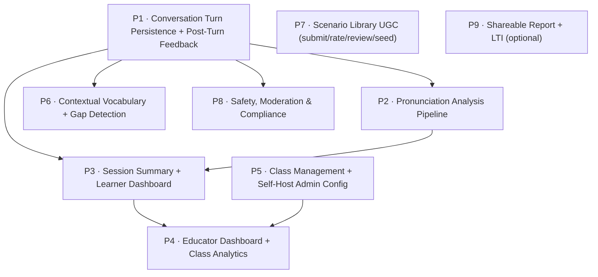

# LECA MVP Completion Roadmap

> **For agentic workers:** This is a **roadmap / plan index**, not an executable task plan. It decomposes the remaining LECA MVP into sequenced per-subsystem plans. Execute each linked plan with superpowers:subagent-driven-development or superpowers:executing-plans. Do **not** try to execute this file directly.

**Goal:** Complete the LECA Phase 0 + Phase 1 MVP described in `docs/leca/BRD.md` (v0.6), `docs/leca/SRS.md` (v1.0), and `docs/leca/ARCHITECTURE.md` (v1.0) by building the subsystems that are still missing on top of the existing foundation.

**Source of truth:** BRD §7–8 (requirements), SRS §3 (FRs), ARCHITECTURE §2–5 (HLD/LLD/data model/API contracts).

---

## 1. What already exists (do not re-plan)

The 16 prior plans in `docs/superpowers/plans/` are merged. Verified by code audit (2026-05-31):

| Area | State | Evidence |
|------|-------|----------|
| Monorepo (turbo + pnpm), CI, tsconfig/eslint packages | DONE | `turbo.json`, `packages/*` |
| Prisma schema — **all 17 MVP tables** | DONE | `apps/api/prisma/schema.prisma` |
| Auth: email/password, JWT, refresh, roles, social backends | DONE (OAuth frontend unwired) | `apps/api/src/auth*` |
| Guest access + 3-session limit | DONE | `apps/api/src/conversations` (`GuestLimitGuard`) |
| Level assessment (5-prompt spoken, CEFR) | DONE | `apps/api/src/assessments`, `apps/web/.../onboarding/assessment` |
| Conversation session create/end + LiveKit room + agent dispatch | DONE | `apps/api/src/conversation-sessions` |
| LiveKit voice agent STT→LLM→TTS (VAD, Whisper, OpenAI-compatible LLM, Kokoro) | DONE | `apps/agent/src/agent.ts` |
| Scenario browse / full-text search / detail / phrases | DONE | `apps/api/src/scenarios`, `apps/web/.../scenarios` |
| Conversation UI (push-to-talk, transcript) | DONE | `apps/web/.../conversation` |
| Admin panel shell (users, files, email) | DONE | `apps/web/.../admin-panel` |
| shadcn/ui design system | DONE | `apps/web/src/components` |

**Key fact:** the database models for turns, feedback, pronunciation, vocabulary, stats, classes, and reviews **all already exist** — most remaining work is business logic + API endpoints + UI, not migrations.

---

## 2. What is missing (the work this roadmap sequences)

From the SRS FR audit, grouped into subsystem plans. Status legend: ❌ missing · ⚠️ partial.

| FR group | Gap | Plan |
|----------|-----|------|
| FR-CONV-04, FR-CONV-08 (turn persistence) | Agent never writes turns; no `POST /turns` endpoint; no feedback JSON | **P1** |
| FR-PRON-01..06 | No Wav2Vec2 pipeline, scoring, or trend | **P2** |
| FR-CONV-08, FR-DASH learner-side | No session summary screen; no learner dashboard | **P3** |
| FR-DASH-05..08 | No educator dashboard / class roster / speaking-time / flagging / export | **P4** |
| FR-SELF-02,03,04,06 | No class CRUD, class-code join, model-config validation, safety flag | **P5** |
| §8.6 / FR-SCEN phrases | No post-session vocab-gap detection, vocab tracking UI | **P6** |
| FR-SCEN-04,05,06,07 | No community submission, rating UI, review workflow, seed library | **P7** |
| FR-CONV-09,10,12; FR-AUTH-04; NFR-COMP | No L1 redirect, content moderation, text fallback, age gate, GDPR export/delete | **P8** |
| FR-DASH-04; FR-SELF-05 | Shareable report + LTI 1.3 (lowest priority, optional for MVP gate) | **P9** |

---

## 3. Execution sequence & dependencies

**Recommended order:** P1 → P2 → P3 → P6 → P5 → P4 → P7 → P8 → P9.

- **P1 is the keystone.** Nothing downstream (pronunciation, summary, dashboards, vocabulary) has data until turns + scores are persisted. Build it first.
- **P2 and P6** both consume persisted turns and can be built in parallel after P1.
- **P5 before P4** because the educator dashboard reads classes/enrollments that P5 creates.
- **P8 and P9** are hardening / institutional features — required for the public-beta gate but not for an internal end-to-end demo.

Each plan below is independently executable and produces working, testable software on its own.

---

## 4. The plans

| # | Plan file | FRs covered | Produces |
|---|-----------|-------------|----------|
| P1 | `2026-05-31-leca-p1-turn-feedback.md` | FR-CONV-04, -08 (turns), -11; data flow §4.3 | Persisted turns with structured feedback, `POST /conversation-sessions/:id/turns`, live feedback over LiveKit data channel |
| P2 | `2026-05-31-leca-p2-pronunciation.md` | FR-PRON-01..06; FR-DASH-02,03 (data) | Wav2Vec2 phoneme scoring (BullMQ job), `pronunciation_scores` populated, color-coded feedback UI, per-phoneme trend |
| P3 | `2026-05-31-leca-p3-summary-dashboard.md` | FR-CONV-08; FR-DASH-01,02,03 | Session summary screen + learner progress dashboard (history, trend chart, weak areas) |
| P4 | `2026-05-31-leca-p4-educator-dashboard.md` | FR-DASH-05,06,07,08 | Educator class roster, speaking-time aggregation, auto weak-area flagging, CSV/PDF export |
| P5 | `2026-05-31-leca-p5-class-admin.md` | FR-SELF-02,03,04,06; FR-DASH-06 (agg job) | Class CRUD + 6-char join code, class-code enrollment UI, model-config validation, content-safety flag |
| P6 | `2026-05-31-leca-p6-vocabulary.md` | BRD §8.6; FR-SCEN-03 phrases | Pre-session key phrases, post-session vocab-gap detection (BullMQ), phrase detail TTS sheet, `user_vocabulary` tracking |
| P7 | `2026-05-31-leca-p7-scenario-ugc.md` | FR-SCEN-04,05,06,07 | Submission form + review queue, rating widget, maintainer review workflow, 20-scenario seed |
| P8 | `2026-05-31-leca-p8-safety-compliance.md` | FR-CONV-09,10,12; FR-AUTH-04; NFR-COMP-01..04, NFR-SEC-06 | L1 redirect, content moderation, text fallback, age gate, GDPR export/delete, XSS sanitisation |
| P9 | `2026-05-31-leca-p9-report-lti.md` | FR-DASH-04; FR-SELF-05 | Shareable progress report (30-day link), LTI 1.3 launch |

> Plans P1–P3 are authored in full alongside this roadmap. P4–P9 are scoped here (FRs, files, acceptance) and authored on demand — run the writing-plans skill per plan when you reach it, using the scope tables in §5.

---

## 5. Scope tables for plans authored on demand (P4–P9)

Each table is the seed for a full plan. When you author the plan, expand every row into bite-sized TDD tasks per the writing-plans skill.

### P4 — Educator Dashboard + Class Analytics
- **New API:** `apps/api/src/progress/` (`progress.module.ts`, `.controller.ts`, `.service.ts`) — endpoints `GET /classes/:id/roster`, `GET /classes/:id/report.csv`.
- **New API:** nightly BullMQ aggregation job writing `daily_user_stats` (`apps/api/src/progress/jobs/aggregate-daily-stats.processor.ts`).
- **Logic:** speaking-time sum per student/week (FR-DASH-06); flag decline > 10 pts over 5 sessions (FR-DASH-07); CSV + PDF export last 4 weeks (FR-DASH-08).
- **New Web:** `apps/web/src/app/[language]/educator/page.tsx` + `page-content.tsx` (roster table, trend arrows, flags), `educator/[classId]/page.tsx`.
- **Depends on:** P1 (sessions/turns), P2 (pron scores), P5 (classes).
- **Acceptance:** roster shows per-student last-active, weekly speaking time, trend arrow, top weak area; declining students visibly flagged; CSV downloads.

### P5 — Class Management + Self-Host Admin Config
- **New API:** `apps/api/src/classes/` — `POST /classes`, `GET /classes`, `POST /classes/join` (6-char code), `DELETE /classes/:id`. Crypto-random `join_code` (NFR-SEC-07), 30-day inactivity expiry.
- **API config:** validate `LECA_LLM_BACKEND` on startup, fail-fast (FR-SELF-04); `LECA_CONTENT_SAFETY` flag plumbed to P8 filter (FR-SELF-06).
- **New Web:** `apps/web/src/app/[language]/join-class/page.tsx` (student code entry), educator class-create in admin panel.
- **Depends on:** none (uses existing `Class`/`ClassEnrollment` models).
- **Acceptance:** teacher creates class → gets code; student joins by code → appears in roster; invalid backend env aborts boot with descriptive error.

### P6 — Contextual Vocabulary + Gap Detection
- **New API:** `apps/api/src/vocabulary/` — BullMQ `vocab-queue` consumer: set-difference of scenario phrases vs transcript → upsert `user_vocabulary`, flag ≤3 unused phrases (BRD §8.6 AC-2). `GET /scenarios/:id/phrases` (exists), `GET /me/vocabulary`.
- **New Web:** pre-session "key phrases" panel on scenario detail; post-session "phrases you could use" block on summary (extends P3); phrase-detail bottom sheet with Kokoro TTS playback (FR §8.6 Should).
- **Depends on:** P1 (turns/transcript), P3 (summary screen).
- **Acceptance:** scenario detail shows ≥5 phrases each with example; summary flags up to 3 unused relevant phrases; tapping phrase plays TTS + shows sentence.

### P7 — Scenario Library UGC
- **New API:** `POST /scenarios` (auth, status=`draft`→`in_review`), `POST /scenarios/:id/ratings` (FR-SCEN-05), maintainer `POST /scenarios/:id/reviews` + status transitions (FR-SCEN-06). Sanitise on render (NFR-SEC-06, see P8).
- **Seed:** `apps/api/prisma/seeds/scenarios.seed.ts` — 20 scenarios across ≥6 categories (FR-SCEN-07) with ≥5 phrases each.
- **New Web:** `apps/web/.../scenarios/submit/page.tsx`, rating stars on `scenarios/[id]`, maintainer review queue in admin panel.
- **Depends on:** scenarios module (exists).
- **Acceptance:** submitted scenario visible only to author until approved; rating aggregates on card; 20 seed scenarios load.

### P8 — Safety, Moderation & Compliance
- **Agent:** language-detect learner transcript → if non-English, redirect + don't score (FR-CONV-09); content-moderation filter before LLM (FR-CONV-10) honouring `LECA_CONTENT_SAFETY`.
- **Web:** text-input fallback when mic denied / SNR <10dB (FR-CONV-12); 13+ age gate on sign-up (FR-AUTH-04).
- **API:** `GET /me/export` (GDPR data export) + `DELETE /me` (account+data delete) (NFR-COMP-01); ToS/Privacy acceptance gate (NFR-COMP-02); XSS sanitisation of scenario content (NFR-SEC-06).
- **Depends on:** P1 (agent loop), P7 (scenario render).
- **Acceptance:** L1 input redirected unscored; profanity blocked + rephrase prompt; mic-denied path still completes a session as text; under-13 blocked; user can export+delete all data.

### P9 — Shareable Report + LTI (optional for MVP gate)
- **API:** `POST /me/reports` → signed 30-day link; PDF render (FR-DASH-04). `apps/api/src/lti/` LTI 1.3 launch + auto-provision (FR-SELF-05).
- **Web:** public report view route `apps/web/.../r/[token]/page.tsx`.
- **Depends on:** P2/P3 (trend data).
- **Acceptance:** report link renders trend + expires after 30 days; Moodle test launch provisions a learner.

---

## 6. Cross-cutting conventions (apply in every plan)

- **API module pattern:** `*.module.ts` / `*.controller.ts` (versioned `@Controller({ path, version: '1' })`, `@ApiTags`, `@ApiBearerAuth`, `AuthGuard('jwt')`) / `*.service.ts` / `dto/*.dto.ts` with `@nestjs/swagger` decorators. Mirror `apps/api/src/conversation-sessions` and `apps/api/src/assessments`.
- **Prisma:** inject existing `PrismaService` from `apps/api/src/database`. Schema is complete — **no new migrations unless a row is genuinely missing.**
- **BullMQ:** queues registered in the owning module; processors under `<module>/jobs/`. Session module enqueues; consumer module processes (ARCHITECTURE §4.2).
- **Web pattern:** route folder under `apps/web/src/app/[language]/<route>/` with `page.tsx` (server entry) + `page-content.tsx` (client UI); data via React Query hooks in `apps/web/src/services/api/services/<feature>.ts`. Mirror `onboarding/assessment`.
- **Shared types:** add request/response zod schemas to `packages/schemas/src` when shared across api/web/agent.
- **Testing (TDD):** API — Jest unit specs next to source (`*.service.spec.ts`) + e2e under `apps/api/test`. Web — component/integration tests. Target NFR-DX-02 ≥70% coverage on non-AI modules. Write the failing test first in every task.
- **Commits:** conventional commits, one per task, frequent.

---

## 7. Definition of done for the MVP

The MVP is complete when, end to end:
1. A guest completes a 3-turn voice conversation (FR-CONV-01..07) ✅ exists.
2. Each turn shows feedback + color-coded pronunciation (P1, P2).
3. Session ends on a summary screen with scores + top-3 weak areas (P3).
4. The learner dashboard shows history + pronunciation trend + weak phonemes (P3).
5. A teacher creates a class, students join by code, the roster shows per-student progress with auto-flags (P4, P5).
6. Scenario detail shows key phrases; summary flags vocab gaps (P6).
7. 20 seed scenarios load; users can submit + rate scenarios (P7).
8. Safety (L1/moderation/age gate) and GDPR export/delete work (P8).
9. Phase-1 gate criteria SRS §7 (AC-P1-01..05) are met.
